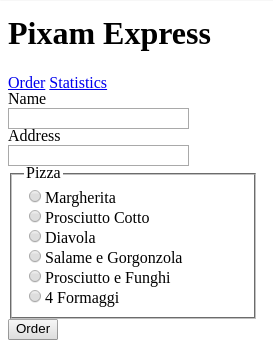
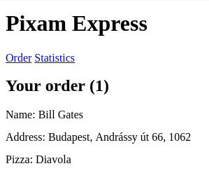
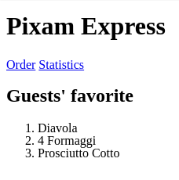

# Pixam Express

We are going to create a simplified pizza delivery application. The name of our
imaginary company is *Pixam Express* because `pizza + exam = pixam`.

**Read the whole description in order to understand the application.**

## `GET /`

- The main page should be rendered
- It should contain a heading, two links and a form with fixed pizza selection
- The form should be submitted to `POST /order`

### The main page



## `POST /order`

- Store the entry in the database
- Redirect to the order page

## `GET /order/{id}`

- The order page should be rendered

### The order page

- It should display the order's id, name, address and the selected pizza



## `GET /api/orders/{id}`

- It should respond with the specified order in the following JSON format

  ```json
  {
    "id": 1,
    "name": "Bill Gates",
    "address": "Budapest, Andrássy út 66, 1062",
    "pizza": "diavola"
  }
  ```

## `GET /statistics`

- The statistic page should be rendered

### The statistics page

- It should display the 3 most ordered pizzas' name


## Question

Given the following table named `applicants`.

| id | name               | country_id | age |
|:---|:-------------------|:-----------|:----|
| 0  | Bořivoj Souček     | 0          | 24  |
| 1  | Papp Patrícia      | 1          | 33  |
| 2  | Kocsis Ivett       | 1          | 37  |
| 3  | Slavomír Vykukal   | 0          | 20  |
| 4  | Bruno Malík        | 0          | 31  |
| 5  | Veronika Lukešová  | 0          | 18  |
| 6  | Székely Miklós     | 1          | 29  |
| 7  | Hegedüs Benjámin   | 1          | 37  |
| 8  | Nela Machová       | 0          | 20  |
| 9  | Balog Rajmund      | 1          | 39  |
| 10 | Major Borbála      | 1          | 35  |
| 11 | Evelína Horváthová | 0          | 23  |
| 12 | Vászoly Vivien     | 1          | 40  |
| 13 | Lada Stýskalová    | 0          | 27  |
| 14 | Dagmar Benešová    | 0          | 33  |

Given the following table named `countries`.

| id | country        |
|:---|:---------------|
| 0  | Czech Republic |
| 1  | Hungary        |

Write an SQL query to select the name and the country of applicants from
Hungary with the age 40.

The expected result should be the following.

| name           | country |
|:---------------|:--------|
| Vászoly Vivien | Hungary |
