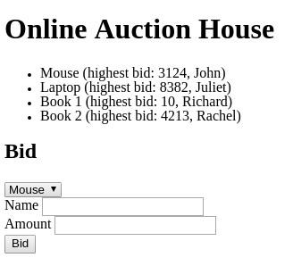
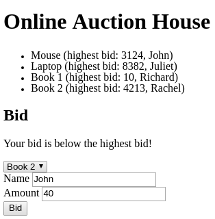
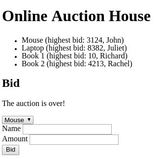

# Full-Stack Auction exam

We are going to create a web-based auction application.

**Read the whole description in order to understand the application.**

- Feel free to add auction items to the database
- We expect that there is always at least auction item in the database
  and all auction item got at least one bid

## `GET /`

- The main page should be rendered
- It must contain a list of all auctions (even the expired ones)
- It must display the title, the highest bid and the bidder's name
- It must contain a form with
  - a drop down menu which contains all the auctions
  - a text field for the bidder's name
  - a text field for the amount
- You should use the `GET /api/items` endpoint to display the auction items in
  the list and in the drop down menu
- The form should be submitted to `POST /api/items/:id/bids`
- Update the DOM based on the response
  - If the bid is less than or equal to the highest bid display the message and
    do not clear the input fields
  - If the auction is over display the message and clear the input fields
  - If it was successful refresh the list of auctions and clear the input fields

### Main Page



#### Message



### Over



## `POST /api/items/:id/bids`

### Request

- The request body must contain the following JSON format

  ```json
  {
    "name": "John",
    "amount": 214
  }
  ```

### Response

- If the bid is less than or equal to the highest bid respond with the following
  JSON format

  ```json
  {
    "message": "Your bid is below the highest bid!"
  }
  ```

- If the auction is over respond with the following JSON format

  ```json
  {
    "message": "The auction is over!"
  }
  ```

- Else store the bid in the database and respond with the following JSON format

  ```json
  {
    "message": "Successful!"
  }
  ```

## `GET /api/items`

- It should respond with the stored auction items in the following JSON format
- The `expiryDate`'s format can be different but must include the year, month,
  day, hour and minute

```json
[
  {
    "id": 4,
    "title": "Book 2",
    "expiryDate": "2018-03-04T23:12:123",
    "highestBid": 4213,
    "highestBidderName": "Rachel"
  }
]
```

## Question

Given the following table named `employees`

| id | name            | role         |
|:---|:----------------|:-------------|
| 0  | Bořivoj Souček  | mentor       |
| 1  | Kocsis Ivett    | psychologist |
| 2  | Papp Patrícia   | mentor       |
| 3  | Dagmar Benešová | psychologist |

And given the following table named `devices`

| id | name                  | serial_number | type   | employee_id |
|:---|:----------------------|:--------------|:-------|:------------|
| 0  | Bořivoj's iPhone      | 123-412-512   | mobile | 0           |
| 1  | Kocsis Ivett's device | 321-234-155   | laptop | 1           |
| 2  | Bořivoj's mobile      | 321-234-155   | mobile | 0           |

Write an SQL query to select the name of those psychologists who have got at
least a mobile phone in an alphabetical order.
